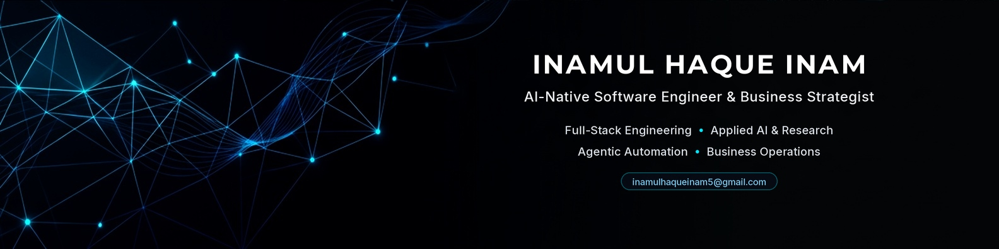

  

  
  
  
  
  

---

### 📌 Executive Overview

I am an agile **AI-Native Software Engineer and Business Strategist** operating at the intersection of scalable software systems, published data science research and high-growth corporate operations.

Rather than fitting into an isolated developer silo, I approach engineering challenges with a hybrid mindset:
* **The Builder:** Full-stack systems architecture (Next.js, TypeScript, React, Node.js and PostgreSQL), client-side optimization and production platforms.
* **The Scientist:** Peer-reviewed scientific publications across IEEE and Elsevier platforms focusing on Explainable AI , clinical predictive modeling and hybrid feature optimization.
* **The Strategist:** International remote operational management (Rectangle International AB, Sweden), B2B sales pipeline architecture (HubSpot, LinkedIn Sales Navigator), executive KPI reporting and process optimization.

---

### ⚡ Core Technical & Strategic Arsenal

<table>
  <tr>
    <td width="50%" valign="top">
      <h4>💻 Full-Stack Software Engineering</h4>
      <ul>
        <li><b>Languages:</b> TypeScript, JavaScript, Python and SQL</li>
        <li><b>Frontend:</b> Next.js, React.js, Tailwind CSS and Playwright E2E</li>
        <li><b>Backend & Systems:</b> Node.js, Express.js, RESTful APIs and Zod Validation</li>
        <li><b>Databases & ORM:</b> PostgreSQL, MongoDB and Prisma ORM</li>
      </ul>
    </td>
    <td width="50%" valign="top">
      <h4>🧠 Applied AI & Machine Learning</h4>
      <ul>
        <li><b>Interpretability:</b> Explainable AI (XAI / SHAP) and Clinical Biomarker Mapping</li>
        <li><b>Machine Learning:</b> Predictive Modeling, Ensemble Learning and Scikit-Learn</li>
        <li><b>Deep Learning:</b> Convolutional Architectures and Attention-Gated Fusion</li>
        <li><b>Data Engineering:</b> Pandas, NumPy and Statistical Data Analysis</li>
      </ul>
    </td>
  </tr>
  <tr>
    <td width="50%" valign="top">
      <h4>🤖 Agentic Workflows & Automation</h4>
      <ul>
        <li><b>Agentic Tooling:</b> Anthropic Claude Code in Action and Skill Suites</li>
        <li><b>Process Automation:</b> Intelligent Process Automation (IPA) Pipelines</li>
        <li><b>Execution Integrity:</b> Deterministic Execution and Tool Orchestration</li>
        <li><b>Developer Experience:</b> GitHub Actions CI/CD and Context-Aware Tooling</li>
      </ul>
    </td>
    <td width="50%" valign="top">
      <h4>📈 Business Strategy & Operations</h4>
      <ul>
        <li><b>CRM & Prospecting:</b> HubSpot Sales Hub Certified and LinkedIn Sales Navigator</li>
        <li><b>Operations:</b> International Workflow QA (Sweden) and SLA Optimization</li>
        <li><b>Analytics:</b> Advanced Excel (Financial Modeling), Power BI and Tableau</li>
        <li><b>Methodology:</b> Agile/Scrum Delivery and 102 WPM Typing Speed</li>
      </ul>
    </td>
  </tr>
</table>

---

### 🚀 Featured Production Systems

<table>
  <thead>
    <tr>
      <th>System</th>
      <th>Architectural Highlights & Impact</th>
      <th>Links</th>
    </tr>
  </thead>
  <tbody>
    <tr>
      <td><b>SkillBridge</b> Full-Stack Tutoring Platform</td>
      <td>
        • Engineered a 3-role RBAC architecture (Student, Tutor and Admin) 
        • Built conflict-free session scheduling algorithms and telemetry dashboards 
        • Full-stack Zod type validation with Next.js, PostgreSQL and Prisma ORM
      </td>
      <td>
        <a href="https://skillbridge-frontend-mocha.vercel.app/"><b>Live Demo</b></a> 
        <a href="https://github.com/inamulhaqueinam5/skillbridge-frontend"><b>Codebase</b></a>
      </td>
    </tr>
    <tr>
      <td><b>OneFit Resume</b> Document Engine & Layout Optimizer</td>
      <td>
        • Single-source Master-to-Derivative structured data model 
        • Zero-cost client-side single-page A4 rendering engine with stepped compression 
        • Deterministic Mammoth/Cheerio DOCX parsing and drag-and-drop customization
      </td>
      <td>
        <a href="https://onefit-resume.vercel.app/"><b>Live Demo</b></a> 
        <a href="https://github.com/inamulhaqueinam5/OneFit-Resume"><b>Codebase</b></a>
      </td>
    </tr>
    <tr>
      <td><b>Executive Banking Portfolio</b> Corporate Web Application</td>
      <td>
        • Architected with Domain-Driven Design (DDD) principles in Next.js 14 
        • Dual-mode theme tokens, interactive career timelines and 24+ skill matrices 
        • Automated end-to-end regression validation with Playwright test suites
      </td>
      <td>
        <a href="https://zannat-ara-nishat.netlify.app"><b>Live Demo</b></a> 
        <a href="https://github.com/inamulhaqueinam5/client-banking-portfolio"><b>Codebase</b></a>
      </td>
    </tr>
    <tr>
      <td><b>AI-Native Portfolio Platform</b> Interactive Personal Engineering Hub</td>
      <td>
        • Architected with Next.js App Router, TypeScript and Tailwind CSS 
        • High-performance interactive research telemetry, publication showcase and dark theme tokens 
        • Production Vercel edge deployment with automated CI/CD and zero layout shift
      </td>
      <td>
        <a href="https://inamul-haque-inam-portfolio.vercel.app/"><b>Live Demo</b></a> 
        <a href="https://github.com/inamulhaqueinam5/inamul-haque-inam-portfolio"><b>Codebase</b></a>
      </td>
    </tr>
  </tbody>
</table>

---

### 🔬 Peer-Reviewed Research & Publications

<table>
  <thead>
    <tr>
      <th>Publication Title</th>
      <th>Venue / Index</th>
      <th>Methodology & Key Results</th>
      <th>DOI / Link</th>
    </tr>
  </thead>
  <tbody>
    <tr>
      <td><b>Explainable Ensemble Learning and Hybrid Feature Selection for Robust Low Birth Weight Prediction</b></td>
      <td>IEEE BECITHCON 2025</td>
      <td>Soft-Voting Ensemble (ExtraTrees + CatBoost) on 1,863 BDHS records; achieved 94.54% Accuracy with full SHAP clinical interpretability.</td>
      <td><a href="https://doi.org/10.1109/BECITHCON69222.2025.11504281"><b>10.1109/BECITHCON</b></a></td>
    </tr>
    <tr>
      <td><b>AIDPCP: An Adaptive Intelligent Data Preprocessing and Clustering Pipeline for Obesity Prediction with Explainable AI</b></td>
      <td>Measurement: Digitalization, Elsevier (2026)</td>
      <td>Formulated an adaptive preprocessing and clustering pipeline resolving data leakage and class imbalance in tabular clinical data.</td>
      <td><a href="https://doi.org/10.1016/j.meadig.2026.100049"><b>10.1016/j.meadig</b></a></td>
    </tr>
    <tr>
      <td><b>A Novel Hybrid Feature Selection and Ensemble Learning Approach for Mortality Risk Classification in Hepatitis B Patients: An Explainable AI Study</b></td>
      <td>IEEE ICCIT 2025</td>
      <td>Biomarker feature selection and gradient boosting ensemble (XGBoost, CatBoost and LightGBM); reached 95.08% Accuracy and 93% F1-score.</td>
      <td><a href="https://doi.org/10.1109/ICCIT68739.2025.11491320"><b>10.1109/ICCIT</b></a></td>
    </tr>
    <tr>
      <td><b>Explainable AI-Driven Ensemble Learning Framework for PCOS Diagnosis Using AIM-PDCF and QuantumGraphRFE Feature Selection</b></td>
      <td>IEEE ICCIT 2025</td>
      <td>Proposed AIM-PDCF ensemble combined with QuantumGraphRFE to identify critical metabolic biomarkers with SHAP clinical explanations.</td>
      <td><a href="https://doi.org/10.1109/ICCIT68739.2025.11491104"><b>10.1109/ICCIT</b></a></td>
    </tr>
    <tr>
      <td><b>DPAFF-Net: Dual-Path Adaptive Feature Fusion Network for Clinical-Grade Tuberculosis Screening from Chest Radiographs</b></td>
      <td>The Journal of Engineering</td>
      <td>Dual-path architecture uniting EfficientNet-B0 and Shallow CNN with Attention-Gated PCA fusion for chest radiograph screening.</td>
      <td><i>Under Review</i></td>
    </tr>
  </tbody>
</table>

---

### 📜 Verified Professional Certifications

* **Anthropic:** Claude Code in Action (Feb 2026) • [Verify](https://verify.skilljar.com/c/62b23fq7qyej)
* **AI Hero:** Skills Workflow Course (Instructor: Matt Pocock) (Aug 2026)
* **HubSpot Academy:** HubSpot Sales Hub Software Certified (Sep 2026 - Oct 2027) • [Verify](https://app-na2.hubspot.com/academy/achievements/n7k9k972/en/1/inamul-haque-inam/hubspot-sales-hub-software-certified)
* **HubSpot Academy:** Inbound Sales Certified (Sep 2026 - Oct 2028) • [Verify](https://app-na2.hubspot.com/academy/achievements/hbhznp3l/en/1/inamul-haque-inam/inbound-sales-certified)
* **LinkedIn Sales Solutions:** Sales Navigator Essentials (Sep 2026) • [Verify](https://verify.skilljar.com/c/b947gbhsm6sw)
* **Udemy:** The Complete SQL Bootcamp: Go from Zero to Hero (Oct 2025) • [Verify](https://ude.my/UC-d470007e-d7c1-4ab2-8223-4b0b13333c3b)
* **Udemy:** Agile Crash Course: Agile Project Management & Scrum Delivery (Oct 2025)
* **IEEE CS SEU SBC:** LaTeX Unlocked Research Writing Workshop (2025)

---

### 📊 GitHub Activity & Telemetry

  
  

  

---

### 📬 Connect & Collaborate

I am actively exploring high-impact opportunities across **Software Engineering**, **AI Solutions**, **Management Trainee Officer (MTO) Programs** and **Technology Consulting**.

  
  
  

